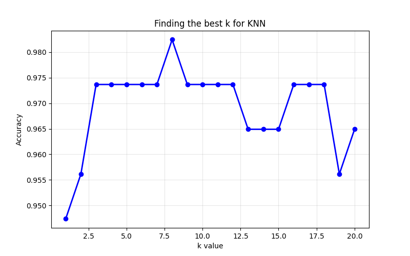
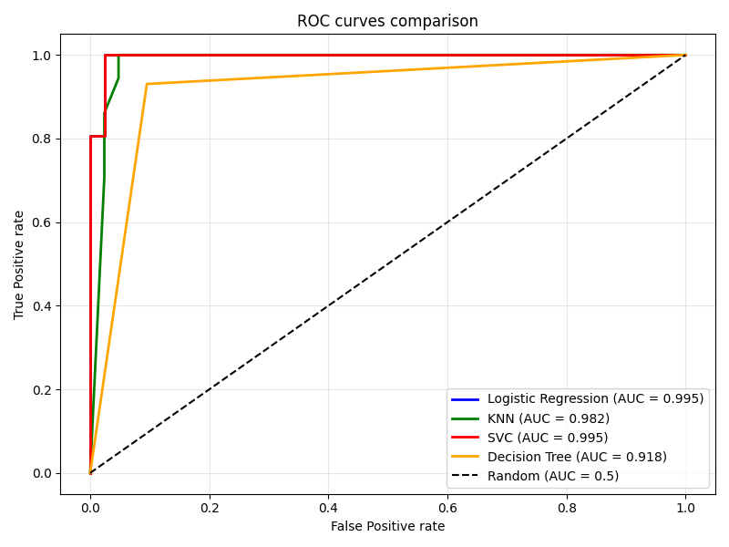

[](README.md)
[](README.fa.md)

---

# تشخیص سرطان سینه

طبقه‌بندی تومورهای سینه به بدخیم یا خوش‌خیم با استفاده از یادگیری ماشین

---

## فهرست مطالب

- [درباره پروژه](#درباره-پروژه)
  - [داده‌ها](#داده-ها)
  - [مدل‌های استفاده شده](#مدل‌های-استفاده-شده)
- [نتایج](#نتایج)
- [تحلیل عملکرد مدل](#تحلیل-عملکرد-مدل)
  - [تقسیم داده‌ها](#تقسیم-داده-ها)
  - [بهترین مدل](#بهترین-مدل-رگرسیون-لجستیک)
- [نمودارها](#نمودار-ها)
- [نصب](#نصب)
- [اجرا](#اجرا)
- [لایسنس](#لایسنس)

---

## درباره پروژه

این پروژه از داده‌های سرطان سینه ویسکانسین برای ساخت و مقایسه چهار مدل مختلف یادگیری ماشین استفاده می‌کند. هدف این است که بر اساس 30 ویژگی از تصاویر هسته سلول‌ها، پیش‌بینی شود که تومور بدخیم است یا خوش‌خیم.

### داده ها

- **منبع**: `load_breast_cancer()` از کتابخانه scikit-learn
- **تعداد نمونه‌ها**: 569
- **ویژگی‌ها**: 30 (میانگین شعاع، بافت، فرورفتگی و غیره)
- **کلاس‌های هدف**:
  - 0 = بدخیم (سرطانی)
  - 1 = خوش‌خیم (غیرسرطانی)

### مدل‌های استفاده شده

- _رگرسیون لجستیک (Logistic Regression)_
- _کی-نزدیک‌ترین همسایه (KNN)_
- _طبقه‌بند بردار پشتیبان (SVC)_
- _درخت تصمیم گیری (Decision Tree)_

### نتایج

| مدل             | دقت    | دقت مثبت | فراخوانی | نمره F1 | AUC-ROC |
| --------------- | ------ | -------- | -------- | ------- | ------- |
| رگرسیون لوجستیک | 0.9825 | 0.9861   | 0.9861   | 0.9861  | 0.9954  |
| KNN             | 0.9825 | 0.9730   | 1.0000   | 0.9863  | 0.9823  |
| SVC             | 0.9737 | 0.9859   | 0.9722   | 0.9790  | 0.9954  |
| درخت تصمیم گیری | 0.9211 | 0.9437   | 0.9306   | 0.9371  | 0.9177  |

> **نکته**: مدل _KNN_ به فراخوانی کامل (1.0000) دست یافت، به این معنی که تمام موارد بدخیم را در مجموعه تست تشخیص داد - بدون هیچ خطای منفی کاذب.

---

## تحلیل عملکرد مدل

### تقسیم داده ها

- **مجموعه آموزش**: 455 نمونه (80% از داده‌ها)
- **مجموعه تست**: 114 نمونه (20% از داده‌ها)
- **روش تقسیم**: نمونه‌گیری تصادفی طبقه‌بندی شده (حفظ تعادل کلاس‌ها)
- **حالت تصادفی**: 42 (برای نتایج قابل تکرار)

### بهترین مدل: _رگرسیون لجستیک_

**دستاورد:** دقت 98.25% با AUC-ROC معادل 0.9954

**دلیل عملکرد بهتر:**

- داده‌های سرطان سینه تا حد زیادی **خطی جداشدنی** هستند
- _رگرسیون لجستیک_ برای طبقه‌بندی دودویی با ویژگی‌های عددی بسیار مناسب است
- مقیاس‌سازی ویژگی‌ها به همگرایی صحیح مدل کمک کرد

---

### نمودار ها



- تنظیم پارامتر _KNN_: نمایش دقت در مقابل مقدار k برای یافتن تعداد بهینه همسایه‌ها

---



- منحنی‌های ROC: مقایسه توانایی همه مدل‌ها در تمایز بین کلاس‌ها

---

## نصب

1. ریپو رو کلون کنید:

```bash
git clone https://github.com/notMehrzad/data-mining-breast-cancer.git
cd data-mining-breast-cancer
```

2. محیط مجازی (virtual environment) ایجاد کنید (اختیاری، اما توصیه می‌شه):

```bash
python -m venv .venv
.venv\Scripts\activate
```

3. کتابخانه های مورد نیاز رو از `requirements.txt` نصب کنید:

```bash
pip install -r requirements.txt
```

---

## اجرا

```bash
python main.py
```

اسکریپت، موارد زیر رو انجام خواهد داد:

1. بارگذاری و بررسی داده‌ها

2. یافتن بهترین مقدار k برای مدل _KNN_

3. آموزش هر چهار مدل

4. نمایش معیارهای عملکرد

5. نمایش منحنی‌های ROC

---

## لایسنس

این پروژه تحت مجوز MIT است - برای جزئیات بیشتر به [LICENSE](LICENSE) مراجعه کنید.
